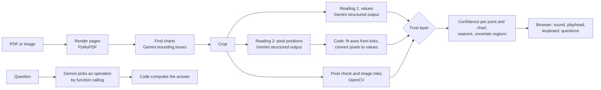

# Hear the Graph

**AI that lets a blind student hear a graph, and tells them when not to trust it.**

Hear the Graph is a website for blind and low-vision STEM students. Upload a lecture PDF or an image. It finds every chart, turns each one into data, and lets you listen to the chart's shape, step through exact values with the keyboard, and ask questions. It checks its own work and says plainly when the numbers cannot be trusted.

## The problem

Lecture slides are full of charts. Screen readers can already ask an AI to describe an image (VoiceOver, JAWS Picture Smart, Be My AI). A description is a few sentences: the student cannot explore exact values, and has no way to know when the description is wrong. For someone who cannot look at the image, a confident wrong number is worse than no number.

Hear the Graph adds two things:

1. **Exploration.** The chart becomes sound and data: a sweep where pitch follows the value and the sound pans from left to right, arrow-key stepping with every value spoken, jumps to the maximum and minimum, a summary, and questions answered by calculation.
2. **A trust layer.** Every chart is read twice by different methods and checked against its own pixels. Each point gets a confidence, each chart gets a level (high, medium, low), and the student hears the reason and which regions are uncertain. Uncertain points are announced as uncertain, and get a soft hiss in the sound.

## How it works



Gemini does three jobs: finding charts, reading them (twice, in two different ways), and choosing which calculation answers a question. **Every number the student hears comes from extracted data and code, never from free-form model text.** For questions, the model is shown the chart's structure but not its y values, and it can only call one of a fixed set of operations: `max`, `min`, `value_at`, `x_where`, `trend`, `slope`, `average`, `range`, `compare`, `crossings`, `describe`, or `cannot_answer`.

### The trust layer

| Signal | What it checks |
|---|---|
| Sanity | Values inside the axis range, x values in order, a plausible number of points, valid structure. |
| Cross-check | Reading 2 gives the plot area, tick positions and point positions. Code fits each axis from the tick labels and converts the pixels to values. Points where the two readings disagree lose confidence. |
| Pixel check | Each value from reading 1 is mapped onto the image. Code looks for ink of the series color there, or measures where the bar really ends. Points that are not on the drawn line or bar lose confidence. |
| Risk factors | No point markers, fewer than four tick labels, both together, low resolution, blur, unevenly spaced ticks, no second reading. These describe the chart: they can lower it to medium, but never mark a point uncertain. A tilted photo (a consistent rotation of the page's lines, measured with a Hough transform) is low until it is straightened. |

A point is uncertain only when a check on that point fails. When the two readings disagree but the drawn line or bar confirms the first reading, the first reading keeps full confidence. Before the axes are fitted, the second reading's tick positions are snapped onto the tick marks and gridlines found in the image.

What the student hears: **High**: "High confidence." **Medium**: "The shape is reliable. Exact values may be off by a few percent." (or, when some points failed their checks, "Most values passed the checks, but some are uncertain. Do not rely on the uncertain values.") **Low**: "Shape only. Do not rely on exact values. Ask a helper or upload the original file."

A tilted phone photo is straightened with OpenCV (the slide's quadrilateral is warped flat) and, in live mode, read again. The better reading is kept, and the app reports the change.

Full design: [`docs/SPEC.md`](docs/SPEC.md). Every decision made during the build, with the reason: [`DECISIONS.md`](DECISIONS.md).

## Screens

- **Landing page** (`/`): what it is and how it works, with a live, playable product window in the hero, the trust layer, accessibility commitments and an FAQ.
- **App start** (`/#/app`): upload (drag and drop or file picker), six built-in samples, and an example chart to try first.
- **Processing and document**: the pipeline steps appear live and are announced to screen readers, then the list of charts with page, type, title and confidence.
- **Chart**: an audio player for a graph. A large chart with a yellow playhead that moves with the sound; a transport bar (play, pause, speed, series, eyes-closed mode); the summary; questions; confidence with reasons; the data table. A **Verify** view draws every extracted point on the image, marked by confidence with shape and label as well as color, beside a table of checks.
- **Eyes-closed mode** blanks the screen, plays the chart, then reveals it, so sighted people can experience a graph by ear.

## Run it

Requirements: Python 3.11+.

```bash
pip install -r requirements.txt
cp .env.example .env        # add GEMINI_API_KEY, or the Google Cloud variables below; leave both empty for fixture mode
uvicorn app.main:app --port 8000
# open http://localhost:8000
```

Without working credentials the app runs in **fixture mode**: the built-in test charts are served from their answer keys under a visible banner that says so, and the full pipeline (cross-check, pixel check, confidence, sound, questions) still runs on them. Other files need a key. Fixture and cached results are never presented as live.

### Backends

Gemini can be reached two ways. Set the variables for one of them in `.env` (or the environment):

| Backend | Variables | Credentials |
|---|---|---|
| Gemini API | `GEMINI_API_KEY` | the key |
| Gemini on Google Cloud (Vertex AI, uses Cloud credits) | `GOOGLE_GENAI_USE_ENTERPRISE=true`, `GOOGLE_CLOUD_PROJECT=<project id>`, `GOOGLE_CLOUD_LOCATION=global` | Application Default Credentials: `gcloud auth application-default login` on a laptop, the service account on Cloud Run. No key. |

When `GOOGLE_GENAI_USE_ENTERPRISE=true` it wins over a key. `/api/health` and the page footer say which backend and model are in use, and each chart names the model that read it. A model id that does not exist on one backend falls through the model chain (`GEMINI_MODEL`, then `GEMINI_FALLBACK_MODEL`). `python tools/list_models.py --ping` works with either backend.

### Deploy to Cloud Run

The service keeps documents and sessions in memory and on the instance's disk, so it must run as **one instance**. The pipeline runs in a background thread after the upload returns, so CPU stays allocated (`--no-cpu-throttling`). The service account needs the **Vertex AI User** role (`roles/aiplatform.user`).

```bash
PROJECT=your-project-id
REGION=us-central1
gcloud services enable run.googleapis.com aiplatform.googleapis.com cloudbuild.googleapis.com artifactregistry.googleapis.com --project $PROJECT
gcloud iam service-accounts create hear-the-graph --project $PROJECT
gcloud projects add-iam-policy-binding $PROJECT \
  --member "serviceAccount:hear-the-graph@$PROJECT.iam.gserviceaccount.com" \
  --role roles/aiplatform.user
gcloud run deploy hear-the-graph --source . --project $PROJECT --region $REGION \
  --service-account "hear-the-graph@$PROJECT.iam.gserviceaccount.com" \
  --max-instances 1 --memory 1Gi --no-cpu-throttling --allow-unauthenticated \
  --set-env-vars "GOOGLE_GENAI_USE_ENTERPRISE=true,GOOGLE_CLOUD_PROJECT=$PROJECT,GOOGLE_CLOUD_LOCATION=global"
```

A public URL can be used by anyone, so the app limits each visitor (by IP address) to 20 new files, 120 questions and 30 retries an hour, and the server to 500 new files a day (`LIMIT_*` in `.env.example`; 0 turns a limit off). Set a budget alert on the project as well.

`--source .` builds the `Dockerfile` with Cloud Build; `.gcloudignore` keeps `.env`, tests and eval data out of the upload. These commands have been run: the service deployed and served the samples from the demo cache, a live upload read on Vertex AI, and questions. The limits are set per deployment with `--update-env-vars`; the hackathon demo runs with high limits (200 documents, 2000 questions and 500 retries per visitor per hour, 2000 documents a day) so judges never hit them, and the $10 budget alert guards the credit. Opening a sample counts as a document.

Docker (the container listens on `$PORT`, default 8080):

```bash
docker build -t hear-the-graph .
docker run -p 8080:8080 -e GEMINI_API_KEY=... hear-the-graph
```

If Gemini answers "high demand" (503) or "quota exceeded" (429), the app backs off and retries, then moves down the model chain in `GEMINI_FALLBACK_MODEL` (quotas are per model). If every model is still busy, the chart says which problem it was and offers **Try again**. To pick models that work for your key right now:

```bash
python tools/list_models.py --ping   # lists your models and which ones answer now
```

Then set `GEMINI_MODEL` and `GEMINI_FALLBACK_MODEL` (comma-separated) in `.env` and restart. Lower `GEMINI_MAX_CONCURRENCY` if you hit rate limits often. To try the interface without any API calls, set `APP_MODE=fixture`.

Configuration is environment variables only (see [`.env.example`](.env.example) and SPEC section 15), so deploying later is a configuration change.

### Tests and evaluation

```bash
pip install -r requirements-dev.txt
pytest                      # 215 tests: logic, API, live path with a fake client, Playwright end to end with axe
python eval/run_eval.py     # writes eval/results.md and eval/results.json
python tools/build_fixtures.py   # rebuilds fixture data from the answer keys
python tools/replay_cache.py     # replays cached live readings through the trust layer, no API calls
python tools/replay_cache.py --baseline <commit>   # ... and compares with an older trust layer
```

The end-to-end tests start their own server and use Chromium through Playwright. If your Playwright version has no browser installed, set `CHROMIUM_PATH`.


## Accessibility

Built to be used from start to finish without sight or a mouse (SPEC section 11):

- Semantic landmarks and headings, labels on every control, a skip link, visible focus (a yellow ring with an indigo edge, readable in both themes).
- Everything spoken goes through ARIA live regions, the standard way a page speaks to screen readers such as VoiceOver, NVDA and JAWS. It has not yet been tested with screen reader users. The optional built-in voice (Web Speech API) is off by default so it never talks over a screen reader.
- Single-key shortcuts (P play, S summary, C confidence, V ask by voice, and Chart2Music's keys) only work while the chart has focus. A shortcut panel lists them.
- **Ask by voice** (browsers with the Web Speech API: Chrome, Edge, Safari; hidden elsewhere). A rising tone means "speak now" (nothing is spoken, so the microphone does not pick up the screen reader), a falling tone means done, and the question is asked when you stop talking. The answer starts with "You asked: ..." so a misheard question is noticed. Spoken numbers ("step seven") work with the rule matcher too. Your browser does the speech to text; in Chrome that goes through Google's speech service.
- Confidence is never color alone: a filled circle for high, a triangle for medium, a hollow diamond with "?" for uncertain, always with a word.
- Reduced motion is respected: the playhead jumps from point to point instead of gliding.
- axe-core reports **zero violations** on every screen, in light and dark themes, at desktop and phone widths (`tests/test_e2e.py`). No screen scrolls sideways at 320 px.

## Responsible AI

- **Overtrust is the main risk** for a user who cannot check the image. The trust layer, the plain-language warnings, the per-point "uncertain" announcements and calculated answers are all aimed at it. A low-confidence chart shows its warning directly under the title.
- **No free-form numbers.** The model chooses operations; code computes and words every number. If the data cannot answer a question, the app says so.
- **Honest labeling.** Fixture data and cached model output are always labeled as such. Every chart names the model that read it, including a fallback model.
- **The answer keys are never sent to the model.** They are read only by the fixture builder and by the eval script, after the pipeline has run.
- **Privacy.** No accounts. Files live in a temporary session folder and are deleted after 60 minutes or when you choose "Delete my files now". Cached model output for uploads is deleted with the document. Course materials are processed for personal accessibility use only.
